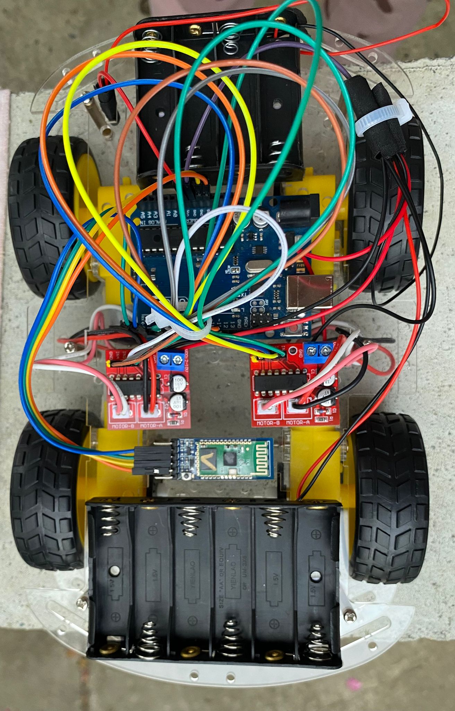
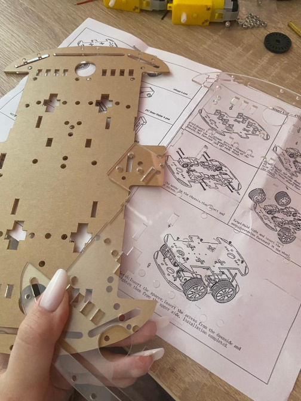
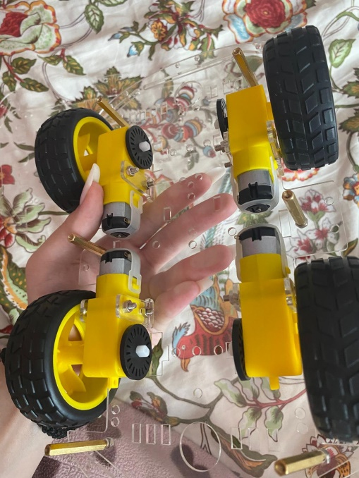
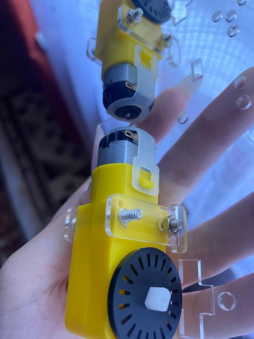
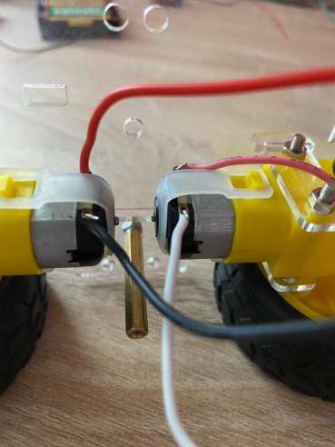
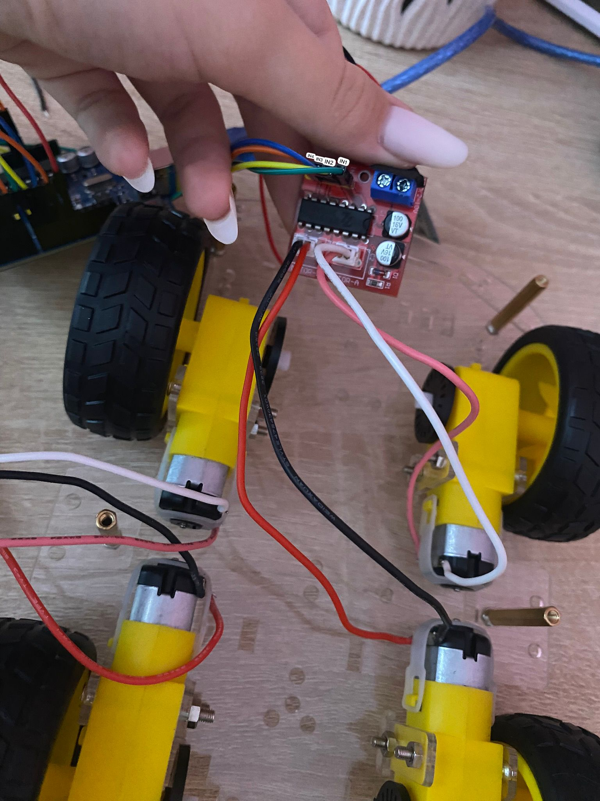
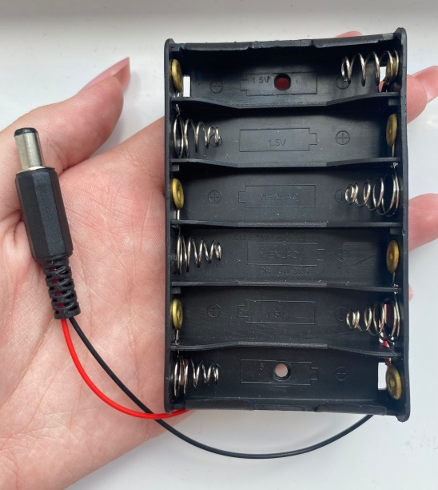
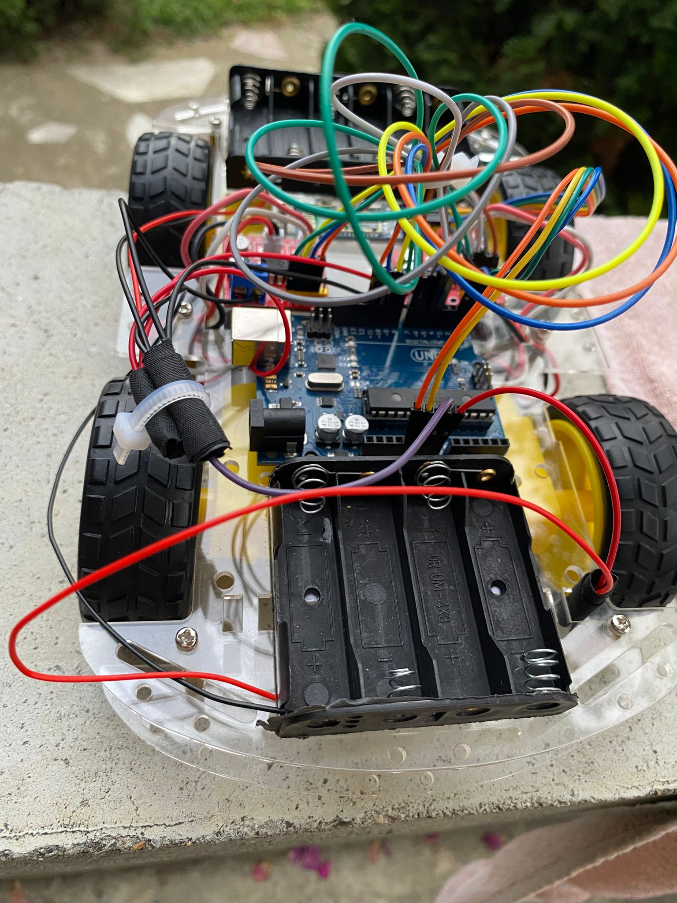

# BluetoothMobileRobot

A Bluetooth-controlled mobile robot built using **Arduino Uno**, **L298N motor drivers**, and the **HC-05 Bluetooth module**.  
The car can be controlled wirelessly from an **Android device** through a dedicated app that sends commands via Bluetooth.

---

## 📸 Images

<p float="left">
  
  
  
  
  
  
  
  
</p>

---

## 📌 Project Overview

This project demonstrates the design and implementation of a **mobile robot car controlled via Bluetooth**.  
It combines knowledge of **electronics, Arduino programming, and wireless communication** to create a simple but functional robotic system.  
The goal was to build a fully working DIY project from scratch, integrating motors, motor drivers, and a Bluetooth module into one interactive robot.

---

## 🎯 Objectives

- Learn how to control DC motors using Arduino and motor drivers.  
- Understand Bluetooth communication between Arduino and a mobile phone.  
- Combine multiple components into a single functional system.  
- Build a working prototype of a Bluetooth-controlled robot car.

---

## 🔧 Components Used

- **Arduino Uno** – main controller for processing commands.  
- **Car chassis kit (4 wheels, motors, frame, screws, battery holder)** – mechanical base.  
- **4x DC Motors** – movement system (soldered for reliable connections).  
- **2x L298N Dual H-Bridge Motor Drivers** – control motor speed and direction.  
- **HC-05 Bluetooth Module** – enables wireless communication.  
- **Battery holders**:  
  - 6×AA batteries (for motors and drivers).  
  - 4×AA batteries (for Arduino).  
- **Jumper wires (male-to-male, male-to-female)** – connections.  
- **Breadboard (optional, for initial testing).**

---

## 📡 Bluetooth Module Setup (HC-05)

The HC-05 module was tested before assembly to ensure proper communication.  
Connections used with **SoftwareSerial**:

- `VCC → 5V (Arduino)`  
- `GND → GND (Arduino)`  
- `RXD → Pin 11 (Arduino)`  
- `TXD → Pin 10 (Arduino)`  
- `EN → Pin 9 (Arduino)`  

Baud rate in AT mode: **38400 bps**  
Default AT command test:  
- Send `AT` → response should be `OK`.

Optional AT commands used:
- `AT+VERSION?`  
- `AT+NAME=RobotCar`  
- `AT+PSWD=0000`  
- `AT+UART=9600,0,0`  

---

## ⚙️ Final Wiring

- **Motor Drivers (L298N):**  
  - Left driver → Arduino pins **8, 9, 10, 11**  
  - Right driver → Arduino pins **4, 5, 6, 7**

- **Motors:** Each driver controls two DC motors (front + back).  

- **Power Supply:**  
  - 6×AA batteries for motor drivers.  
  - 4×AA batteries for Arduino (shared GND with drivers).  

- All grounds were soldered together for stability.  

---

## 💻 Arduino Code (Bluetooth Test Example)

```cpp
#include <SoftwareSerial.h>

SoftwareSerial BTSerial(10, 11);  // RX | TX

void setup() {
  pinMode(9, OUTPUT);
  digitalWrite(9, HIGH);

  Serial.begin(38400);
  Serial.println("Enter AT Commands:");
  BTSerial.begin(38400); // HC-05 AT mode baud rate
}

void loop() {
  if (Serial.available())
    BTSerial.write(Serial.read());

  if (BTSerial.available())
    Serial.write(BTSerial.read());
}
